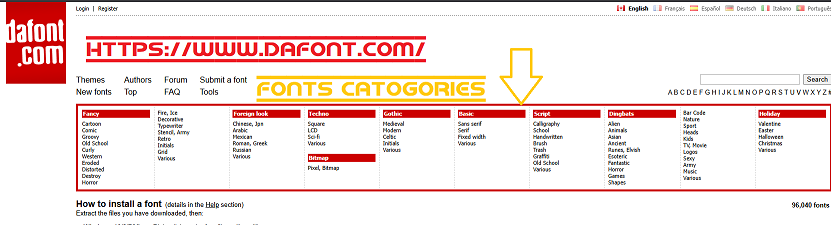
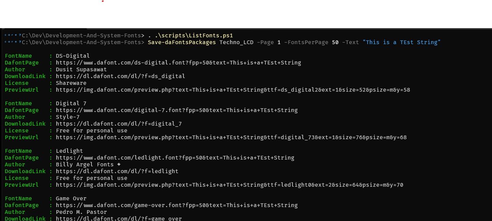
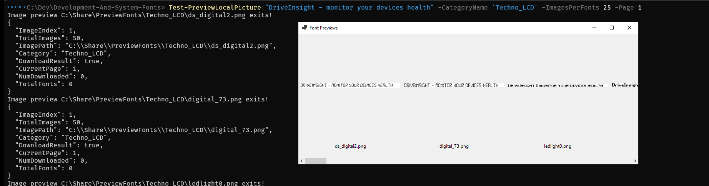

<center>

</center>

I love that classic “retro computer,” “hacker terminal,” or **green/amber monochrome monitor** look, but with modern readability.

So over the course of multiple projects, I collected my favourite fonts for that effect—**widely used by devs, sysadmins, and retro fans**.

In short:* 

* For *real* “retro CRT/hacker” look: **VT323** or **PxPlus IBM VGA8**
* For readable, retro-inspired coding: **IBM Plex Mono** or **JetBrains Mono**
* All are free, and you can install multiple and try them in Windows Terminal’s preview window.

---

## **Recommended Fonts for Retro/Hacker Terminal Vibe**

### **1. [IBM Plex Mono](https://github.com/IBM/plex)**

* Modern IBM font, inspired by old terminals.
* Looks sharp, readable, and “techy.”
* *Great for code, very popular in the community.*

### **2. [Fira Mono](https://github.com/mozilla/Fira) / [Fira Code](https://github.com/tonsky/FiraCode)**

* Fira Mono for classic monospace.
* Fira Code adds programming ligatures (optional, “fancy” arrows).
* Clean, readable, slightly “modern retro.”

### **3. [JetBrains Mono](https://www.jetbrains.com/lp/mono/)**

* Modern, open source.
* Great readability, “hacker” look with a nice slashed zero.
* Used by many coders and hackers for its looks and clarity.

### **4. [PxPlus IBM VGA8](https://int10h.org/oldschool-pc-fonts/)**

* **If you want the *most authentic* old PC look:**
* It’s a pixel-perfect replica of IBM’s original VGA BIOS font.
* Looks *just like* 80s/90s MS-DOS and BBS screens.
* Install from [Oldschool PC Fonts](https://int10h.org/oldschool-pc-fonts/download/).

### **5. [Perfect DOS VGA 437](https://www.dafont.com/perfect-dos-vga-437.font)**

* Another pixel-accurate DOS font.
* Instantly recognizable “hacker movie” terminal vibe.

### **6. [VT323](https://fonts.google.com/specimen/VT323)**

* Mimics the DEC VT220 terminal.
* Single weight, retro CRT look.
* Available free on Google Fonts and works well on Windows Terminal.

### **7. [Hack](https://sourcefoundry.org/hack/)**

* Designed for code, clean, modern but with classic aesthetics.
* Easy to read, very popular with “hacker” theming.

---

## **How to Use in Windows Terminal**

1. **Download and install the TTF/OTF file for your chosen font.**

2. In Windows Terminal settings (`settings.json` or UI), set:

   ```json
   "fontFace": "IBM Plex Mono"
   ```

   *(or whatever the font is called in Windows font list)*

3. Set color scheme to **green-on-black** or “Campbell” for more retro vibes.

---

## **Personal Top 3 for “Retro/Hacker” Look:**

* **VT323** – For pure CRT/green-screen vibes.
* **PxPlus IBM VGA8** – For the most accurate DOS/BIOS BBS effect.
* **IBM Plex Mono / JetBrains Mono** – For “modern hacker” look, with great readability.

---

## **Quick Links for Downloads**

* **VT323:** [Google Fonts](https://fonts.google.com/specimen/VT323)
* **IBM Plex Mono:** [GitHub Releases](https://github.com/IBM/plex/releases)
* **PxPlus IBM VGA8:** [Oldschool PC Fonts](https://int10h.org/oldschool-pc-fonts/)
* **Perfect DOS VGA 437:** [DaFont](https://www.dafont.com/perfect-dos-vga-437.font)
* **Hack:** [Official](https://sourcefoundry.org/hack/)
* **JetBrains Mono:** [Official](https://www.jetbrains.com/lp/mono/)


- [DotoGeoHandjetRubikGlitchSyneMonoetc.zip](packages/RetroHackerTerminalVibe/DotoGeoHandjetRubikGlitchSyneMonoetc.zip)
- [FiraCodev6.2.zip](packages/RetroHackerTerminalVibe/FiraCodev6.2.zip)
- [Hack-windows-installer-1.6.0.zip](packages/RetroHackerTerminalVibe/Hack-windows-installer-1.6.0.zip)
- [JetBrainsMono-2.304.zip](packages/RetroHackerTerminalVibe/JetBrainsMono-2.304.zip)
- [oldschoolpcfontpackv2.2FULL.zip](packages/RetroHackerTerminalVibe/oldschoolpcfontpackv2.2FULL.zip)
- [perfectdosvga437.zip](packages/RetroHackerTerminalVibe/perfectdosvga437.zip)
- [VT323.zip](packages/RetroHackerTerminalVibe/VT323.zip)


<center>

</center>


<center>

</center>


## daFonts.com

The packages Im using from **daFonts.com** are listed in the [packages/daFonts.com](packages/daFonts.com) folder.

The script [ListFonts](scripts/ListFonts.ps1) is a quick and dirty tool to get and preview the online fonts locally.


### Fonts Categories

```powershell
> Get-PreviewFontsCategories

Culture_Various
Culture_Modern
Techno_Various
Techno_Square
Techno_Square
Techno_LCD
General_Stencil_Army
General_Typewriter
General_Various
```


<center>

</center>


### Get Download and Preview Urls

```powershell
> Save-daFontsPackages Techno_LCD -Page 1 -FontsPerPage 50 -Text "This is a TEst String"

FontName     : DS-Digital
DafontPage   : https://www.dafont.com/ds-digital.font?fpp=50&text=This+is+a+TEst+String
Author       : Dusit Supasawat
DownloadLink : https://dl.dafont.com/dl/?f=ds_digital
License      : Shareware
PreviewUrl   : https://img.dafont.com/preview.php?text=This+is+a+TEst+String&ttf=ds_digital2&ext=1&size=52&psize=m&y=58

FontName     : Digital 7
DafontPage   : https://www.dafont.com/digital-7.font?fpp=50&text=This+is+a+TEst+String
Author       : Style-7
DownloadLink : https://dl.dafont.com/dl/?f=digital_7
License      : Free for personal use
PreviewUrl   : https://img.dafont.com/preview.php?text=This+is+a+TEst+String&ttf=digital_73&ext=1&size=76&psize=m&y=68

FontName     : Ledlight
DafontPage   : https://www.dafont.com/ledlight.font?fpp=50&text=This+is+a+TEst+String
Author       : Billy Argel Fonts �
DownloadLink : https://dl.dafont.com/dl/?f=ledlight
License      : Free for personal use
PreviewUrl   : https://img.dafont.com/preview.php?text=This+is+a+TEst+String&ttf=ledlight0&ext=2&size=64&psize=m&y=70
```

<center>

</center>


### Show Previews

```powershell
> Test-PreviewLocalPicture "DriveInsight - monitor your devices health" -CategoryName 'Techno_LCD' -ImagesPerFonts 25 -Page 1
Image preview C:\Share\PreviewFonts\Techno_LCD\ds_digital2.png exits!
{
  "ImageIndex": 1,
  "TotalImages": 50,
  "ImagePath": "C:\\Share\\PreviewFonts\\Techno_LCD\\ds_digital2.png",
  "Category": "Techno_LCD",
  "DownloadResult": true,
  "CurrentPage": 1,
  "NumDownloaded": 0,
  "TotalFonts": 0
}
Image preview C:\Share\PreviewFonts\Techno_LCD\digital_73.png exits!
{
  "ImageIndex": 1,
  "TotalImages": 50,
  "ImagePath": "C:\\Share\\PreviewFonts\\Techno_LCD\\digital_73.png",
  "Category": "Techno_LCD",
  "DownloadResult": true,
  "CurrentPage": 1,
  "NumDownloaded": 0,
  "TotalFonts": 0
```


<center>

</center>


<center>

</center>

